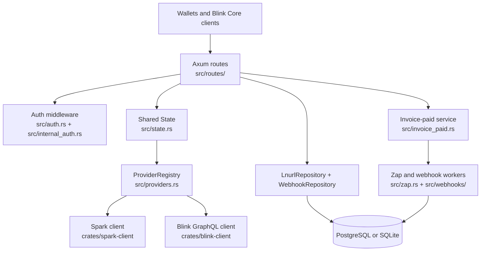

# Architecture

## System Overview

`lnurl-server` is an Axum-based Rust service that exposes LNURL-pay, Lightning Address, LUD-21 verification, NIP-57 zap, provider account-management, and webhook endpoints for Spark and Blink-backed recipients. The service accepts public LNURL wallet requests, authenticated Spark management requests, Blink Core internal account requests, Spark SSP callbacks, and Blink invoice callbacks; it outputs LNURL metadata, BOLT11 invoices, account metadata, zap receipts, durable webhook deliveries, and payment verification state. The architecture is layered around HTTP route handlers, provider-neutral domain models, provider implementations, repository traits with PostgreSQL and SQLite adapters, and Tokio background workers for side effects.

## Component Diagram



## Data Flow

### Public LNURL metadata and invoice creation

1. A wallet requests `/.well-known/lnurlp/{identifier}` or `/lnurlp/{identifier}`.
2. `src/routes/lnurl_pay.rs` sanitizes the request host through the allowed-domain cache, parses username/phone identifiers and optional `+btc` or `+usd` wallet modifiers, and resolves the canonical recipient through `LnurlRepository::resolve_recipient_by_identifier`.
3. The route returns LNURL metadata with a callback URL under `/lnurlp/{identifier}/invoice`.
4. When the wallet calls the invoice callback, the route validates amount, comments, zap request size, NIP-57 zap data, and provider-specific expiry constraints.
5. `ProviderRegistry::provider_for` dispatches invoice creation to either `SparkProvider` or `BlinkProvider`.
6. The returned BOLT11 invoice is parsed and checked for the expected amount and description hash before an invoice record is persisted for verification, zap, settlement, and webhook handling.

### Spark account management

1. Spark-compatible clients call `/lnurlpay/{pubkey}` management routes for availability, registration, deletion, transfer, recovery, metadata listing, invoice-paid notifications, and zap receipt publication.
2. `src/auth.rs` optionally enforces bearer X.509 client-certificate authentication when a CA certificate is configured.
3. `src/routes/account.rs` validates Spark public keys, signatures, timestamps, usernames, descriptions, and domain ownership.
4. Route handlers mutate provider-neutral account and identifier state through `LnurlRepository` methods such as `upsert_spark_registration`, `delete_spark_registration`, and `transfer_identifier`.

### Blink internal account management

1. Blink Core calls routes mounted under `/internal`, including `/internal/blink/accounts`, `/internal/domains/{domain}/identifiers/{identifier}`, and `/internal/identifiers/transfer-to-spark`.
2. `src/internal_auth.rs` validates JWTs against configured JWKS material and enforces route-specific scopes.
3. `src/routes/internal.rs` validates domains, identifiers, wallet defaults, Blink account IDs, wallet IDs, and transfer requests.
4. Blink accounts are stored as provider-neutral accounts with Blink provider details, and `(domain, identifier)` ownership remains unique across providers through repository operations.

### Invoice settlement and side effects

1. Spark SSP callbacks hit `/webhook` and must include a valid `X-Spark-Signature` HMAC over the request body using the shared database-backed webhook secret.
2. Blink invoice callbacks hit `/webhook/blink` with a payment hash, payment status, optional preimage, and optional BOLT11 payment request.
3. Settlement routes validate payloads, look up known invoices, and call `handle_invoice_paid` when a preimage can settle the invoice.
4. `src/invoice_paid.rs` verifies the preimage hash, stores paid invoice state, enqueues pending zap receipts, enqueues outbound domain webhooks, and signals background workers through a Tokio watch channel.
5. `src/zap.rs` claims pending zap receipt rows, publishes NIP-57 receipts to relays when Nostr keys are configured, and retries with backoff.
6. `src/webhooks/background.rs` claims pending webhook deliveries, signs outbound payloads with HMAC-SHA256, applies per-domain concurrency limits, retries failures, parks or deletes deliveries without active configs, and periodically cleans old rows.

## Key Abstractions

| Abstraction | Location | Purpose |
|-------------|----------|---------|
| `State<DB>` | `src/state.rs` | Dependency container cloned into Axum extensions; holds repositories, provider registry, clients, config values, auth state, caches, keys, and worker trigger channels. |
| `LnurlServer<DB>` | `src/routes/mod.rs` | Generic namespace for route handlers compiled against any database backend implementing the repository traits. |
| `LnurlRepository` | `src/repository.rs` | Core persistence boundary for users, accounts, identifiers, invoices, sender comments, zaps, domains, settings, and webhook payload lookup. |
| `WebhookRepository` | `src/webhooks/repository.rs` | Persistence boundary for outbound webhook configs and durable delivery queue operations. |
| `AccountProvider`, `WalletKind`, `ResolvedRecipient` | `src/repository.rs` | Provider-neutral account model used by routes and providers to represent Spark/Blink recipients and wallet selection. |
| `ProviderRegistry` and `LnurlProvider` | `src/providers.rs` | Dispatch layer that selects Spark or Blink provider implementations for invoice creation and payment status checks. |
| `SparkProvider` | `src/providers.rs` | Adapter that creates Spark Lightning invoices through `crates/spark-client`. |
| `BlinkProvider` | `src/providers.rs` | Adapter that creates BTC or USD invoices and checks payment status through `crates/blink-client`. |
| `ParsedIdentifier` and `WalletModifier` | `src/identifier.rs` | Canonical username/phone parsing with optional final wallet modifier handling for public routes. |
| `PendingZapReceipt` and `WebhookDelivery` | `src/repository.rs`, `src/webhooks/repository.rs` | Durable queue rows used to coordinate background side effects across service instances. |

## Directory Structure Rationale

```text
.
├── src/                    # Main lnurl-server binary, HTTP routes, domain services, auth, state, and database adapters.
│   ├── routes/             # Axum route groups split by account, internal, LNURL-pay, webhook, and zap responsibilities.
│   ├── postgresql/         # PostgreSQL SQLx repository implementation and migration runner.
│   ├── sqlite/             # SQLite SQLx repository implementation and migration runner.
│   └── webhooks/           # Outbound webhook queue, background delivery, config cache, and service facade.
├── crates/
│   ├── blink-client/       # Small GraphQL client for Blink invoice creation and payment status operations.
│   └── spark-client/       # Spark SDK adapter for invoice creation, message verification, and SSP webhook registration.
├── migrations/
│   ├── postgres/           # PostgreSQL schema migrations matching the repository model.
│   └── sqlite/             # SQLite schema migrations kept equivalent to PostgreSQL migrations.
├── bats/                   # End-to-end shell tests for LNURL protocol and auth endpoints.
├── tests/                  # Rust integration test support and integration-style tests.
├── scripts/                # Local stack helper scripts.
├── ci/                     # Concourse release, Docker build, and chart update pipeline tasks.
└── .github/workflows/      # GitHub Actions checks for code quality, integration, E2E, audit, and spelling.
```

The source tree separates protocol-facing routes from provider adapters and storage backends. `src/routes/` owns request parsing and response shape compatibility, `src/providers.rs` owns provider-specific invoice behavior, and `src/repository.rs` plus backend directories keep persistence portable across PostgreSQL and SQLite. Background side effects live outside route latency in `src/zap.rs` and `src/webhooks/`, with database-backed queues used for multi-instance safety.

## Entry Points

- `src/main.rs` defines the `lnurl-server` binary declared in `Cargo.toml`; it parses CLI/config/env values, initializes tracing, selects PostgreSQL or SQLite, optionally runs migrations, builds providers, starts workers, registers routes, and serves Axum with graceful shutdown.
- `src/bin/e2e_auth.rs` supports Bats auth endpoint tests by generating deterministic Spark identity data.
- `src/bin/e2e_zap_request.rs` supports E2E zap request generation.
- `src/bin/blink_graphql_mock.rs` provides a local Blink GraphQL mock for Blink-provider tests.

## Cross-Cutting Concerns

- **Configuration:** `src/main.rs` merges CLI defaults, an optional TOML config file, and `LNURL_` environment variables through Figment.
- **Authentication:** Spark management routes use optional bearer X.509 validation in `src/auth.rs`; internal Blink routes use scoped JWT validation in `src/internal_auth.rs`.
- **Domain validation:** Allowed domains are stored in the database, seeded from configuration on startup, and refreshed through `src/domains.rs` into an `Arc<RwLock<HashSet<String>>>` cache.
- **Provider separation:** Routes resolve recipients and dispatch to `LnurlProvider` implementations instead of embedding Spark or Blink invoice creation directly.
- **Persistence portability:** Repository traits are implemented by both `src/postgresql/repository.rs` and `src/sqlite/repository.rs`, with parallel migration directories.
- **Background work:** Zap receipts and outbound webhooks use durable database queues and wake-up signals rather than in-memory-only queues.
- **Protocol validation:** LNURL amount bounds, description hashes, NIP-57 zap requests, webhook signatures, and preimage/payment-hash relationships are validated before persisted state is updated.
- **Body size and CORS:** The router applies permissive CORS for GET, POST, DELETE, and OPTIONS, and caps request bodies at 1,000,000 bytes in `src/main.rs`.
